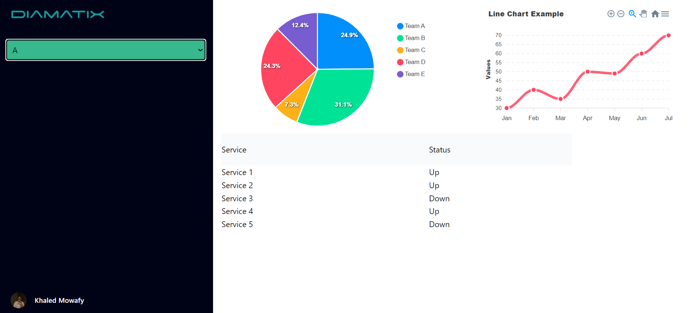

  <h1>Diamatix Dashboard</h1>
    
This project is a basic dashboard built for Diamatix Company. It features a dropdown menu to select customers and 
    dynamically updates the chart data based on the selected customer. The project is designed using the Atomic Design methodology.

    <h2>Technologies Used</h2>
    <ul>
        <li><strong>React</strong></li>
        <li><strong>Tailwind CSS</strong></li>
        <li><strong>Vite</strong></li>
    </ul>
    <h2>Features</h2>
    <ul>
        <li><strong>Dropdown Menu:</strong> Allows selecting between customers (A and B).</li>
        <li><strong>Dynamic Chart:</strong> Updates the data in the chart based on the selected customer.</li>
        <li><strong>Atomic Design:</strong> The project is structured following the Atomic Design principles for better scalability and maintainability.</li>
    </ul>
    <h2>Project Structure</h2>
    
The project follows the Atomic Design methodology, which divides the UI components into five distinct levels: Atoms, Molecules, Organisms, Templates, and Pages.

    <h2>Installation</h2>
    
To run this project locally, follow these steps:

    <ol>
        <li><strong>Clone the repository:</strong></li>
        <pre><code>git clone https://github.com/KhaledMowafy/diamatix.git</code></pre>
        <li><strong>Navigate to the project directory:</strong></li>
        <pre><code>cd diamatix</code></pre>
        <li><strong>Install the dependencies:</strong></li>
        <pre><code>npm install</code></pre>
        <li><strong>Run the project:</strong></li>
        <pre><code>npm run dev</code></pre>
        
The application will start in development mode and can be accessed at <code>http://localhost:5173/</code>.

    </ol>
    <h2>Screenshots</h2>
    

    
    